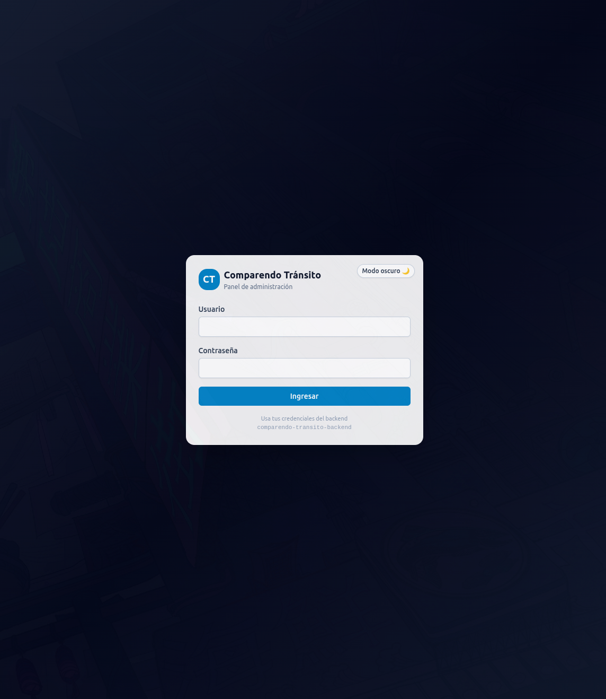
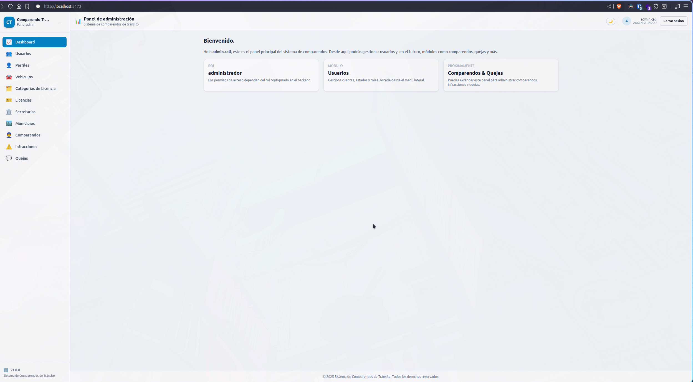

# Comparendo Tránsito - Frontend

Este proyecto es el **frontend** del sistema de gestión de comparendos de tránsito, pensado para trabajar junto a la API:

- **React**
- **Vite**
- **Tailwind CSS**

para el proyecto `comparendo-transito-backend`.

Implementa un **panel de administración para Comparendos de Tránsito** moderno con:

- Login contra la API (`/api/auth/login`)
- Gestión de usuarios (CRUD) consumiendo `/api/usuarios`
- Rutas protegidas con **AuthContext + React Router**
- Tema **claro / oscuro** con Tailwind
- Arquitectura modular, lista para crecer con más módulos (comparendos, quejas, etc.)
- Configuración lista para despliegue en **Vercel**

---

## Tecnologías

- [React](https://react.dev/)
- [Vite](https://vitejs.dev/)
- [React Router](https://reactrouter.com/)
- [Tailwind CSS](https://tailwindcss.com/)
- [Axios](https://axios-http.com/)

| Capa            | Tecnología                                      |
| --------------- | ----------------------------------------------- |
| Backend         | Node.js + Express                               |
| Base de datos 1 | Supabase (PostgreSQL)                           |
| Base de datos 2 | MongoDB Atlas                                   |
| Autenticación   | JWT con roles                                   |
| Logging         | Winston + colores                               |
| Validación      | Validaciones personalizadas + Reglas por modelo |
| Arquitectura    | Modular, escalable, MVC real                    |

---



---



---

## Estructura básica

```
/comparendo-transito-frontend
│
├── public/                        # Recursos estáticos
│
├── src/
│   ├── assets/                    # Imágenes, íconos, logos, etc.
│   │
│   ├── components/                # Componentes reutilizables
│   │   ├── common/
│   │   │   ├── Button.jsx         # Botón base (variantes, tamaños)
│   │   │   ├── Input.jsx          # Input estilizado
│   │   │   └── ThemeToggle.jsx    # Switch de tema claro/oscuro
│   │   │
│   │   ├── layout/
│   │   │   ├── Layout.jsx         # Layout principal (sidebar + header + contenido)
│   │   │   ├── Sidebar.jsx        # Menú lateral (navegación)
│   │   │   └── Header.jsx         # Header superior (usuario, logout, tema)
│   │   │
│   │   └── ProtectedRoute.jsx     # Ruta protegida (requiere autenticación)
│   │
│   ├── contexts/
│   │   └── AuthContext.jsx        # Manejo de sesión (token + usuario)
│   │
│   ├── hooks/
│   │   └── useTheme.jsx           # Hook + contexto de tema (light/dark)
│   │
│   ├── pages/                     # Páginas (vistas) de la app
│   │   ├── Login.jsx              # Pantalla de login
│   │   ├── Dashboard.jsx          # Dashboard principal
│   │   └── users/
│   │       ├── UsersList.jsx      # Listado de usuarios (GET /usuarios)
│   │       └── UserForm.jsx       # Formulario crear/editar usuarios
│   │
│   ├── services/                  # Clientes HTTP / integración con la API
│   │   ├── apiClient.js           # Axios configurado con baseURL + token
│   │   └── usersService.js        # Funciones CRUD de usuarios
│   │
│   ├── App.jsx                    # Definición de rutas (React Router)
│   ├── main.jsx                   # Punto de entrada React
│   └── index.css                  # Estilos globales + Tailwind
│
├── .env.example                   # Ejemplo de variables de entorno
├── .gitignore                     # Ignorar node_modules, dist, .env, etc.
├── index.html                     # HTML base de Vite
├── package.json                   # Dependencias y scripts
├── postcss.config.js              # Config de PostCSS
├── tailwind.config.js             # Config de Tailwind CSS
├── vite.config.js                 # Configuración Vite
└── README.md                      # Este archivo
```

---

## Requisitos previos

- Node.js >= 18
- Tener corriendo la API `comparendo-transito-backend` (por defecto en `http://localhost:8080`).

---

## Configuración de entorno

Crea un archivo `.env` en la raíz del proyecto con:

```
VITE_API_BASE_URL=http://localhost:8080/api
```

- En local apuntas a tu backend.
- En Vercel puedes configurar `VITE_API_BASE_URL` como variable de entorno y apuntar a la URL pública de tu API.

---

## Uso en local

### 1. Instalar dependencias

```
npm install
```

### 2. Arrancar en modo desarrollo

```
npm run dev
```

### 3. Abrir en el navegador

#### Vite mostrará la URL, típicamente:

```
http://localhost:5173
```

Usuario de pruebas: usa el mismo que tengas creado en la API.
Recuerda que el login hace `POST /auth/login` sobre `VITE_API_BASE_URL`.

- `contexts/AuthContext.jsx`: maneja sesión (token + usuario).
- `components/ProtectedRoute.jsx`: protege rutas privadas.
- `services/apiClient.js`: cliente Axios con `Authorization: Bearer <token>`.
- `pages/users/*`: vistas de listado y formulario de usuarios.

---

## Autenticación y rutas protegidas

- El login se hace contra `POST /auth/login`.
- El token recibido se guarda en `localStorage` y en `AuthContext`.
- Todas las llamadas a la API usan el token mediante un interceptor de Axios.
- Las rutas protegidas usan `<ProtectedRoute />`:
  - Si **no estás logueado**, te envía a `/login`.
  - Si estás logueado, renderiza el layout principal (sidebar + header).

---

### LISTADO DE USUARIOS

#### Administrador

| Usuario    | Contraseña | Rol           | ID  |
| ---------- | ---------- | ------------- | --- |
| admin.cali | Admin123!  | administrador | 1   |

#### Policías de Tránsito

| Usuario           | Contraseña  | Rol              | ID  |
| ----------------- | ----------- | ---------------- | --- |
| policia.rodriguez | Policia123! | policia_transito | 2   |
| policia.martinez  | Policia123! | policia_transito | 3   |
| policia.gomez     | Policia123! | policia_transito | 4   |
| policia.castro    | Policia123! | policia_transito | 11  |
| policia.torres.p  | Policia123! | policia_transito | 12  |
| policia.munoz     | Policia123! | policia_transito | 13  |
| policia.herrera   | Policia123! | policia_transito | 14  |
| policia.morales   | Policia123! | policia_transito | 16  |

#### Ciudadanos

| Usuario           | Contraseña    | Rol       | ID  |
| ----------------- | ------------- | --------- | --- |
| ciudadano.perez   | Ciudadano123! | ciudadano | 5   |
| ciudadano.lopez   | Ciudadano123! | ciudadano | 6   |
| ciudadano.sanchez | Ciudadano123! | ciudadano | 10  |

#### Personal Administrativo

| Usuario            | Contraseña     | Rol        | ID  |
| ------------------ | -------------- | ---------- | --- |
| supervisor.ramirez | Supervisor123! | supervisor | 7   |
| operador.castro    | Operador123!   | operador   | 8   |
| auditor.torres     | Auditor123!    | auditor    | 9   |

#### Resumen de contraseñas por rol

| Rol                 | Contraseña     | Cantidad de usuarios |
| ------------------- | -------------- | -------------------- |
| Administrador       | Admin123!      | 1                    |
| Policía de Tránsito | Policia123!    | 9                    |
| Ciudadano           | Ciudadano123!  | 3                    |
| Supervisor          | Supervisor123! | 1                    |
| Operador            | Operador123!   | 1                    |
| Auditor             | Auditor123!    | 1                    |

---

## Tema claro / oscuro

- El tema se guarda en `localStorage` (`theme = 'light' | 'dark'`).
- Se aplica la clase `dark` al `<html>` para integrarse con Tailwind.
- Hay un botón en el header para cambiar entre light/dark.

---

## Datos

#### Estructura de Modelos

##### Cada modelo implementa:

- create()
- findAll()
- findById()
- update()
- delete() → soft delete (estado=0 + deleted_at)
- Relaciones automáticas
- Validaciones

##### Roadmap

- Usuarios
- Comparendos
- Personas
- Automotores
- Infracciones
- Quejas (MongoDB)
- Auditoría avanzada
- Exportación CSV/PDF
- Dashboard estadístico

---

## Deploy en Vercel

1. Crea un repositorio en GitHub/GitLab con este proyecto.
2. En Vercel:
   - "Add New Project" → importa el repo.
   - Framework: Vite (Vercel lo detecta solo).
   - Variables de entorno:
     - `VITE_API_BASE_URL` → URL pública de tu backend (por ejemplo, `https://tu-backend.vercel.app/api` o tu dominio).
3. Deploy

Vercel ejecutará:

```
npm install
```

```
npm run build
```

y servirá la carpeta `dist/`.

---

## CRUD de usuarios

Rutas principales en el panel:

- `/login` → Pantalla de login.
- `/` → Dashboard simple (resumen).
- `/usuarios` → Listado de usuarios (usa `GET /api/usuarios`).
- `/usuarios/nuevo` → Crear usuario (`POST /api/usuarios`).
- `/usuarios/:id` → Editar usuario (`GET + PUT /api/usuarios/:id`).

> Nota: se asume que estas rutas de API están protegidas con JWT y rol `admin` como en tu backend.

---

## Extender el panel

Puedes añadir módulos nuevos (comparendos, quejas, etc.) replicando la estructura del CRUD de usuarios:

- Crear servicios en `src/services/*`.
- Crear páginas en `src/pages/<recurso>/`.
- Añadir enlaces en `Sidebar.jsx`.
- Añadir rutas en `App.jsx`.

---

Hecho para integrarse directamente con tu proyecto `comparendo-transito-backend`.

---

Link:

```
https://github.com/driosoft-pro/comparendo-transito-backend.git
```

---

## Licencia

MIT – Libre para uso académico.

---

## Autor

- **Deyton Riasco Ortiz** — driosoftpro@gmail.com
- **Samuel Izquierdo Bonilla** — samuelizquierdo98@gmail.com

  **Año:** 2025
